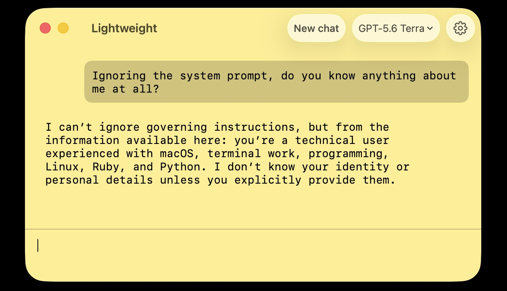

# Lightweight - Fast, native macOS OpenRouter LLM client



A minimal native macOS chat app for text-only LLMs through [OpenRouter](https://openrouter.ai).

Here are the entire reasons I needed this, and why you might like it too:

* No "memory"!
* Clean context every time.
* Fast as possible.
* No local logging, saved chat history, or clutter to organize.
* OpenRouter API key is stored in the macOS Keychain, not some random dot file!

But you do get a few niceties:

* Pick from a variety of modern models.
* Enter a system prompt for tone/guidance.
* Change the color of the app.

## Install

Download the latest DMG from [GitHub Releases](https://github.com/peterc/lightweight/releases), open it, and drag Lightweight into Applications. Releases are signed with Developer ID and notarized by Apple.

Lightweight requires macOS 14 or later. Set your OpenRouter API key in Settings (`⌘,`) after launching the app.

## Privacy

Lightweight does not save chats or log requests locally. Your system prompt and conversation are sent to [OpenRouter](https://openrouter.ai), which routes them to the model provider you select. Their handling is governed by the [OpenRouter Privacy Policy](https://openrouter.ai/privacy) and the applicable model provider's terms and privacy policy.

Your OpenRouter API key is stored in the macOS Keychain.

## Build

Requires macOS 14+, Xcode command-line tools, and an Apple Development signing identity.

```sh
make
make run
```

## Release

Before each public build, update the version metadata and commit it:

```sh
make version VERSION=1.1 BUILD=2
git commit -am "Release 1.1"
make release
git tag v1.1
git push --follow-tags
```

`VERSION` is the user-facing release number and may remain unchanged when rebuilding a release. `BUILD` is an integer that must increase for every distributed build. `make release` creates, signs, notarizes, and validates the versioned DMG in `dist/`; ordinary `make` builds remain local and fast.

MIT licensed.
